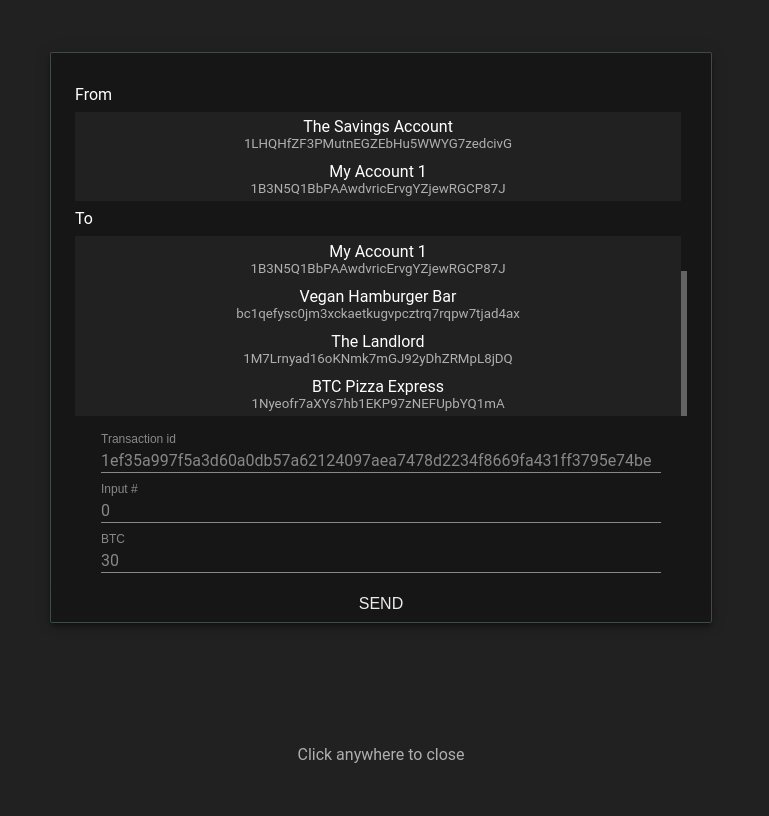

# Tiny Bitcoin Explorer

Webserver -> json -> bitcoin rpc, the stuff.

Built with a preview version of bunny-components, my web components library 🐰

**Requires: Python 3.6.3+**

**Dependencise**
- aiohttp (rqeuired)
- ecdsa (optional; required for private key generation)
- base58 (optional, required for private key generation)

### Structure

Sources are in 
- main.py - starts the event loop.
- server/btcrpc.py - bitcoin node rpc connector.
- web.py - serves the website and api endpoints.

Web resources
- web/script/bitcoin.js - server api integration. 
- index.html & web/script/bitcoin-explorer.js - web ui 

### Features

- create/import private keys (wif).
- key management in local storage.
- block/transaction explorer.
- spending of tx outputs.
- chain info/metadata.

 :warning: **Security alert**  :warning:

- No authentication to access the rpc node enabled (don't import keys into the wallet!)
- Private keys are stored in the browser using local-storage, NOT encrypted.
- For educational purposes only!

### Bitcoin configuration

Make sure to enable the bitcoin nodes rpc server, example configuration (`~/.bitcoin/bitcoinf.conf`)

```
server=1
rpcuser=<my_rpc_user>
rpcpassword=<the_strong_and_very_long_password>
rpcthreads=128
rpcworkqueue=2048
txindex=1
reindex=1
```

### Installing

```bash
pip install requirements.txt
python main.py # enter rpc user/password
```

Starts a HTTP server on port 8080.

Block explorer


Transaction dialog


