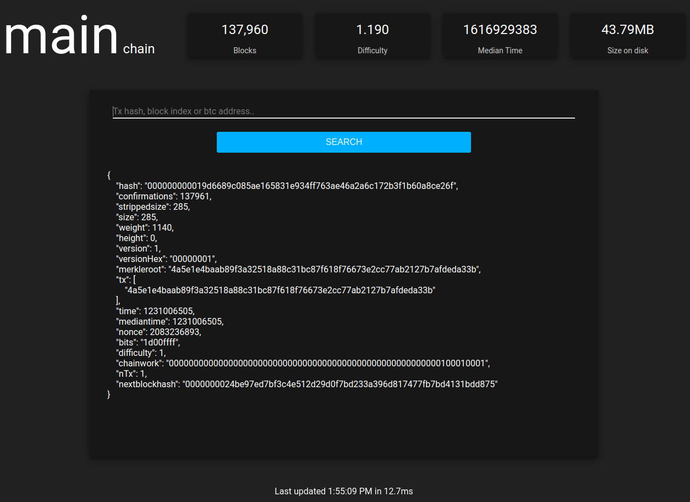

# Tiny Bitcoin Explorer

Webserver -> json -> bitcoin rpc, the stuff.

Built with a preview version of bunny-components, my web components library 🐰

Requires: Python 3.6.3+ and aiohttp!

### Structure

Sources are in 
- main.py - starts the event loop.
- server/btcrpc.py - bitcoin node rpc connector.
- web.py - serves the website and api endpoints.

Web resources
- web/script/bitcoin.js - server api integration. 
- index.html & web/script/bitcoin-explorer.js - web ui 

### Installing

```bash
pip install requirements.txt
python main.py # enter rpc user/password
```

Starts a HTTP server on port 8080.


